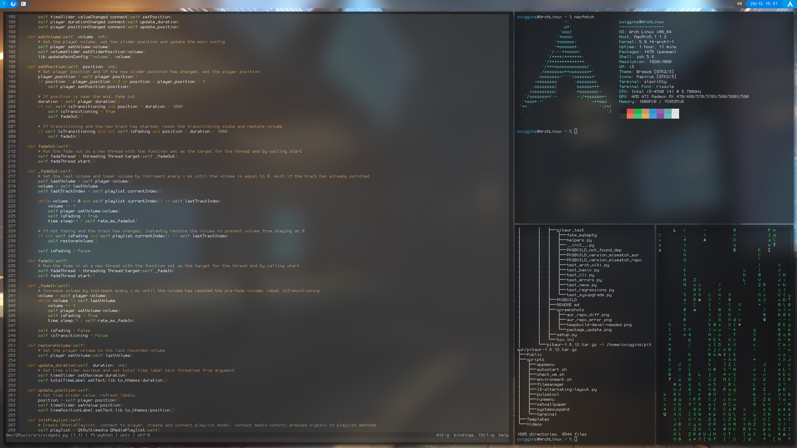

### linux-dotfiles
Configuration for Arch Linux kernel version 5.9.14

## Features
- i3 tiling window manager or KDE Plasma desktop environment
- alacritty Terminal
- polybar Status bar with custom theme
- rofi menus
- picom Compositor
- zsh configuration (see `.profile` for aliases)
- Firefox config with photon-australis and scrolling close to the configuration on the Arch wiki
- Shell scripts for automation

## Other Programs In Use
- Visual Studio Code
- micro Text Editor

## Themes
- Icons: Papirus
- Gtk3: Arc
- Qt5: Oxygen / Breeze

### Other used DEs and WMs
- gnome
- openbox

# Packages
`i3-wm` `alacritty` `rofi` `hsetroot` `polybar` `python3` `qt5ct` `lxappearance` `i3lock-fancy` `plasma-meta` `ly`

AUR: `picom-ibhagwan-git`

AUR helper used: `pikaur`

# Usage
- Install the packages which you require
- ***Run `./install.sh`. This will overwrite your current terminal configuration and some other configuration files***
- Run `systemctl enable ly.service` to get a text-based desktop manager
____

- Use `lxappearance` and `qt5ct` to set themes
- To fix application theming when switching to Plasma, remove the line `export QT_QPA_PLATFORMTHEME=...` from `.xinitrc`. Keep this when using other WMs
- To use the Firefox configuration, go to Firefox > about:config > search for stylesheets and enable the legacy profiles option

# i3 Bindings

**Modifier**: alt

**Rofi dmenu for programs and execution**: mod + d

**Select window**: mod + arrow keys

**Move window**: mod + arrow keys

**Resize window**: mod + r

**Close window**: mod + shift + Q

**Exit i3**: mod + shift + E

See the i3 wiki for the other standard shortcuts such as workspace switching.
____

Enjoy!

## Screenshots

